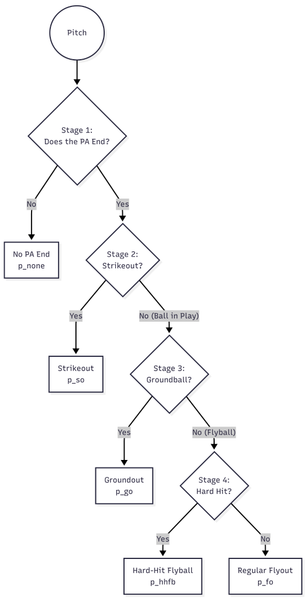
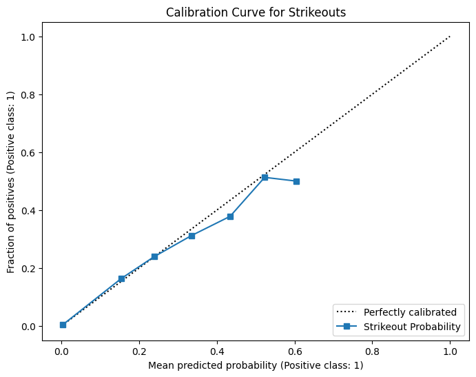
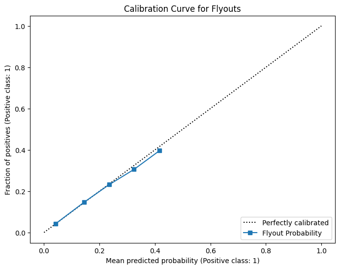
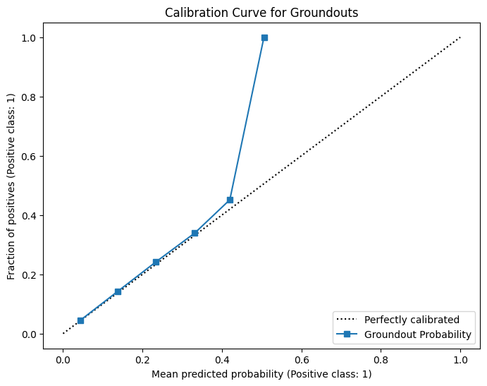
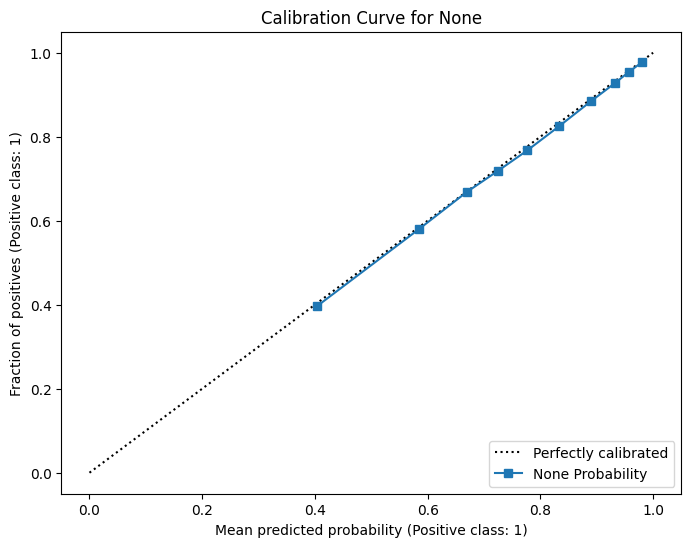
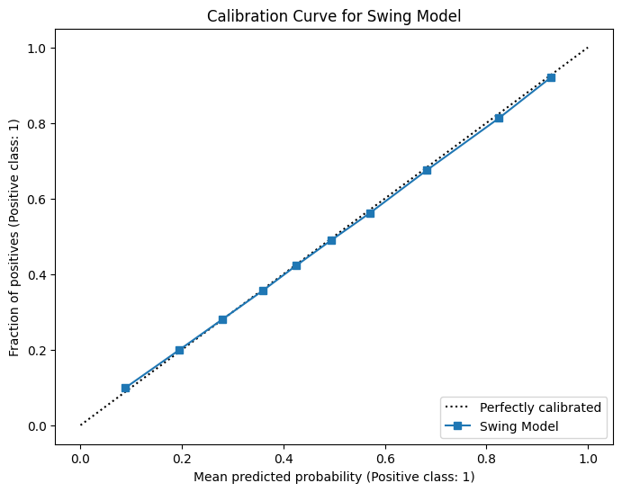
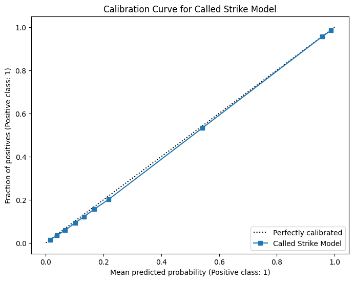
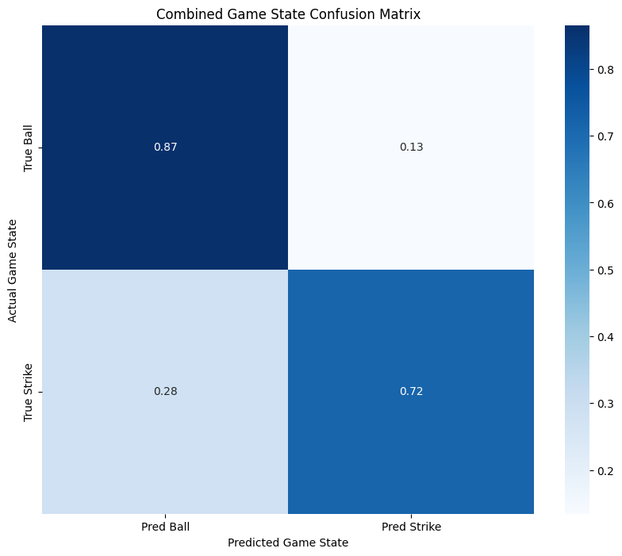

# RNN Support Models Overview

The RNN Support Models are given a pitch type and game state from the RNN and return outputs to determine the next steps of the overall model. 

## Out Type Model

### Overview
The Out Type Model predicts the probability that a given pitch results in one of the three types of outs: strikeout, groundout, or flyout, as well as no out. It is a staged XGBoost pipeline with four stages, each predicting a probability. The stages are shown in the following diagram:

1. Stage 1: PA End Model (`pa_end_model_v2.pkl`):
    - Predicts the probability that the PA will end on this pitch: P(PA End)
2. Stage 2: Strikeout Model (`so_model_v2.pkl`):
    - Predicts the probability of a strikeout given that the PA ends: P(SO | PA End)
    - If not strikeout, then it is a ball in play: P(BIP | PA End) = 1 - P(SO | PA End)
3. Stage 3: Groundball Model (`bip_model_v2.pkl`):
    - Predicts the probability of a groundball given that it is a ball in play: P(GB | BIP)
    - If not groundball, then it is a flyball: P(FB | BIP) = 1 - P(GB | BIP)
4. Stage 4: Flyball Model (`fb_model_v2.pkl`):
    - Predicts the probability of a hard-hit flyball given that it is a flyball: P(HHFB | FB)
    - If not a HHFB, then it is a flyout: P(FO)

### Output
The Out Type Model outputs 5 probabilites:
- `p_none`: Probability that the PA continues
- `p_so`: Probability that the given pitch results in a strikeout
- `p_go`: Probability that the given pitch results in a groundout
- `p_fo`: Probability that the given pitch results in a flyout
- `p_hhfb`: Probability that the given pitch results in a hard-hit flyball, to prevent recommending pitches that risk home runs

### Probabilities

The final output probabilites are computed by using the probabilities from each stage and combining them using the chain rule:

- `p_none` = 1 - P(PA End)
- `p_so` = P(PA End) * P(SO | PA End)
- `p_go` = P(PA End) * (1 - P(SO | PA End)) * P(GB | BIP)
- `p_fo` = P(PA End) * (1 - P(SO | PA End)) * (1 - P(GB | BIP)) * (1 - P(HHFB | FB))
- `p_hhfb` = P(PA End) * (1 - P(SO | PA End)) * (1 - P(GB | BIP)) * P(HHFB | FB)

### Features
The Out Type Model uses features based on the current game state and are in such categories:
1. Historical Features: Prior-season overall statistics for pitcher and batter tendencies (e.g. whiff rates, chase rates, etc.)
2. Location-Specific Metrics: Prior-season location specific statistics for pitcher and batter tendencies. This captures how the pitcher and batter performs based on a given zone.
3. Pitch-Specific Metrics: Prior-season pitch specific statistics for pitcher and batter tendencies. This captures how the pitcher and batter performs based on a given pitch type (e.g. FF, SI, etc.)
4. Game State: The current game context (e.g. balls, strikes, runners on, etc.)

### Results
| Strikeout | Flyout |
|-----------|---------|
|  |  |

| Groundout | None |
|------------|------|
|  |  |
## Transition Model

### Overview
If the current pitch is not determined as a terminating pitch, then the Transition Model handles the transition to the next game state. It predicts whether the pitch will result in a ball or a strike. The Transition Model is also a staged XGBoost pipeline with two stages:

1. Stage 1: Swing Model (`swing_model_v2.pkl`):
    - Predicts the probability that the batter will swing on this pitch: P(Swing)
2. Stage 2: Called Strike Model (`called_strike_model_v2.pkl`):
    - Predicts the probability that the pitch will be called a strike: P(Called Strike)

### Output
The Transition Model outputs 2 probabilites:
- `p_strike`: Probability that the pitch is a strike
- `p_ball`: Probability that the pitch is a ball

### Probabilities

The final output probabilites are computed by using the probabilities from each stage and combining them using the chain rule:

- `p_strike` = P(Swing) + P(Called Strike)
- `p_ball` = (1 - P(Swing)) * P(Ball | Take)

### Features
The Transition Model uses similar features as the Out Type Model, but only includes a smaller, more-specialized subset in predicting strikes/balls. The features can be broken down in the same categories:
1. Historical Features: Prior-season overall statistics for pitcher and batter tendencies (e.g. whiff rates, swing rates, etc.)
2. Location-Specific Metrics: Prior-season location specific statistics for pitcher and batter tendencies. This captures how the pitcher and batter performs based on a given zone.
3. Pitch-Specific Metrics: Prior-season pitch specific statistics for pitcher and batter tendencies. This captures how the pitcher and batter performs based on a given pitch type (e.g. FF, SI, etc.)
4. Game State: The current game context (e.g. balls, strikes, runners on, etc.)

### Results
| Swing | Called Strike |
|-----------|---------|
|  |  | 

